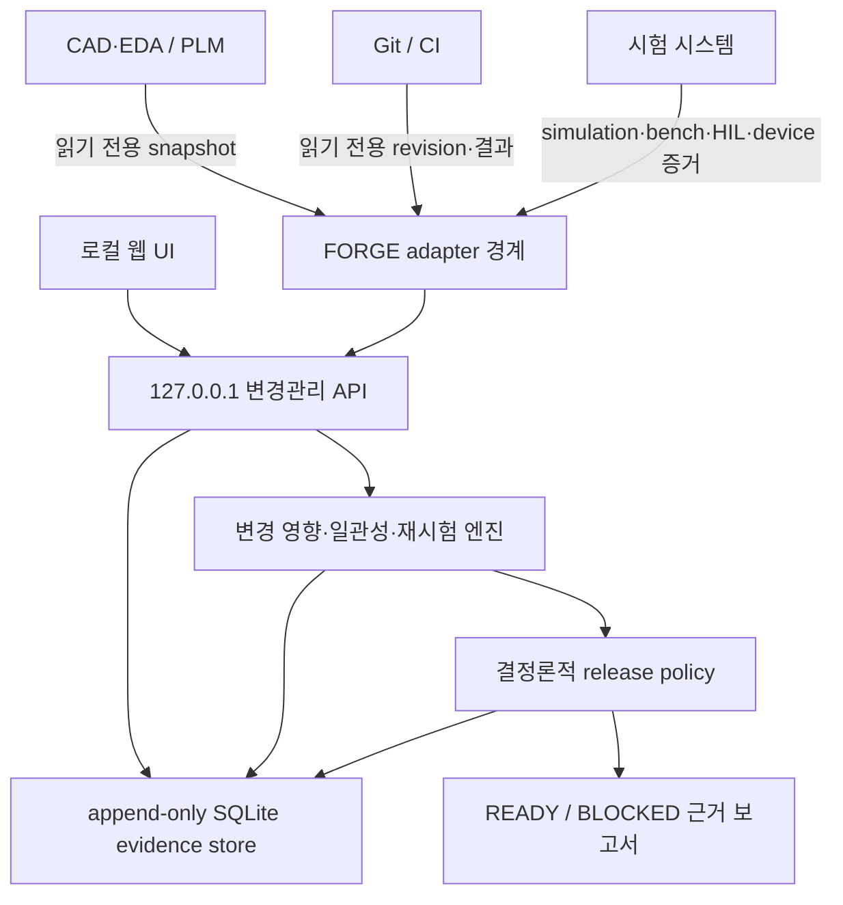
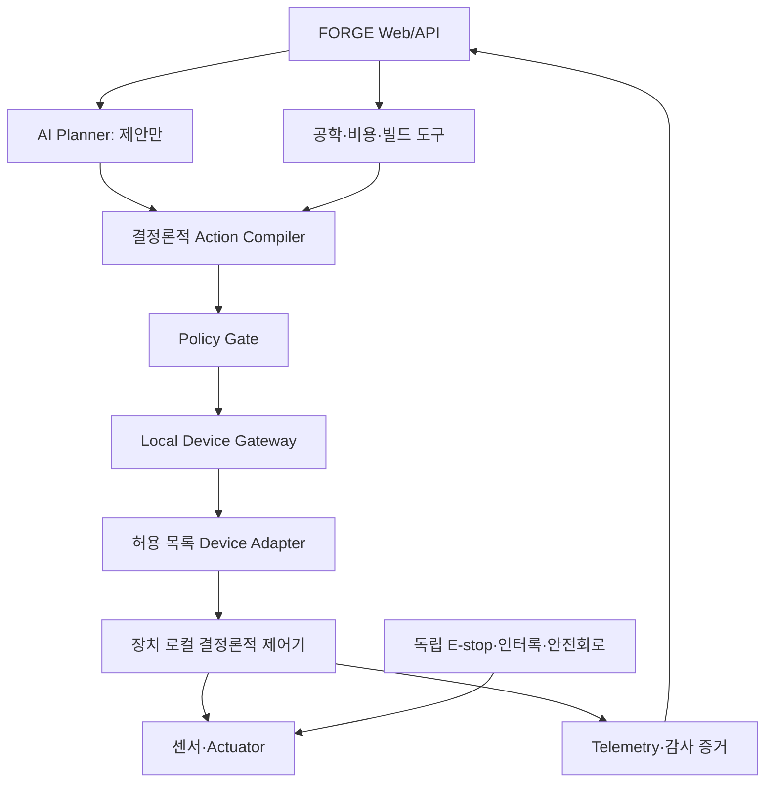

# Project FORGE — 엔지니어링 변경관리 AI PRD v4

- 작성일: 2026-08-29
- 상태: 변경관리 제품 기준선
- 문서 소유자: 프로젝트 오너
- 구현 기준: 이 문서와 `AGENTS.md`
- 대체 문서: PRD v1~v3와 기존 범용 공동설계 포지셔닝

## 1. 이번 버전에서 확정한 결정

1. FORGE는 **로봇·임베디드 제품의 엔지니어링 변경관리와 출시 검증**에 집중한다. 범용 AI 엔지니어나 CAD 생성기가 아니다.
2. CAD는 형상·도면, PLM은 승인 revision·BOM, Git은 source revision, CI는 build·시험 실행 결과를 계속 소유한다.
3. FORGE는 원본 시스템을 대체하거나 수정하지 않고 읽기 전용 snapshot을 연결하는 검증 계층이다.
4. hardware revision 변경을 기준 사건으로 삼아 firmware, BOM, test, protocol, documentation의 영향을 추적한다.
5. pin·전압·단위·명령 범위·protocol schema의 불일치는 결정론적 규칙으로 검증한다.
6. BOM 가격은 공급자·출처·조회 시점·유효기간·통화·MOQ·배송·세금 범위를 함께 저장해야 한다.
7. firmware build와 시험 결과는 실행한 Git/CI revision, toolchain, artifact hash와 함께 수집한다.
8. `simulation`, `bench`, `HIL`, `physical_device` 증거는 명시적으로 구분하며 낮거나 다른 tier의 증거로 대체하지 않는다.
9. 변경된 artifact와 dependency graph에 따라 필수 재시험을 자동 지정한다. 의존성이 불명확하면 보수적으로 재시험한다.
10. 출시 판정은 `READY` 또는 `BLOCKED`이며 모든 차단 사유와 사용한 증거를 기계 판독 가능하게 보고한다.
11. `READY`는 정의된 release policy를 충족했다는 뜻일 뿐 안전 인증·법규 적합성·양산 승인을 뜻하지 않는다.
12. AI는 변경 요약·의심 불일치·설명 초안을 제안할 수 있지만, 검증 결과·재시험·출시 판정은 버전이 고정된 정책과 코드가 생성한다.
13. 로그인 없는 로컬 우선 제품으로 시작하며 외부 시스템 connector는 최소 권한·읽기 전용을 기본값으로 한다.
14. Pydantic 모델을 스키마의 단일 원본으로 사용하고 불변 snapshot과 append-only 판정 이력을 SQLite에 저장한다.
15. 첫 수직 절편은 한 로봇/임베디드 reference project에서 hardware revision 변경부터 출시 보고서까지 재현한다.

## 2. 문제 정의

로봇·임베디드 팀은 CAD/EDA export, PLM/BOM, Git repository, CI, 시험 장비와 문서를 각각 운영한다. 그러나 hardware revision이 바뀌었을 때 어느 firmware·시험·protocol·문서를 다시 검증해야 하는지 한 시스템이 책임지지 않는다. 이 과정에서는 다음 문제가 반복된다.

- 기계 형상, 전기 연결, 핀 할당, 펌웨어와 BOM이 서로 다른 문서에서 변경되어 revision 불일치가 발생한다.
- 설계가 예산을 만족한다는 주장에 가격 출처, 통화, 시점과 배송·세금 범위가 빠져 재현되지 않는다.
- 하드웨어 변경 뒤 이전 펌웨어가 잘못된 핀·전압·통신 계약으로 설치될 수 있다.
- 시뮬레이션 통과와 실제 장치 시험 통과가 같은 "완성"으로 오해된다.
- 변경 영향이 누락되어 필요한 bench/HIL/실장 시험이 실행되지 않는다.
- build·시험 로그가 출시 대상 hardware/firmware revision과 결합되지 않는다.
- 출시 회의에서 사람이 여러 도구의 화면을 모아 근거를 재구성해야 한다.

FORGE는 원본 도구의 승인·실행 권한을 가져오지 않는다. 각 도구의 불변 snapshot과 증거를 정규화하고, 변경 영향·불일치·필수 재시험을 계산한 뒤 현재 출시 후보가 `READY`인지 `BLOCKED`인지 근거와 함께 판정한다.

## 3. 초기 사용자와 핵심 작업

### 3.1 초기 사용자

5~100명 규모 로봇·임베디드 제품 팀의 release engineer, systems lead, hardware/firmware lead, validation lead가 초기 사용자다. 여러 저장소와 시험 환경 사이의 revision 일치 여부를 수작업으로 확인하는 팀을 우선한다.

### 3.2 핵심 작업

> 새 hardware revision을 선택하면 영향받은 firmware·BOM·시험·protocol·문서를 확인하고, 자동 지정된 재시험과 수집된 증거를 검토한 뒤 근거가 완전한 출시 가능·불가능 판정을 받는다.

### 3.3 사용자 성공 지표

- 골든 revision 변경 corpus에서 영향받은 artifact와 필수 재시험 누락률은 0%다.
- pin·전압·단위·명령 범위·protocol schema 불일치를 100% 탐지한다.
- `READY` 판정에 필요한 build·시험·BOM 증거가 하나라도 없거나 만료되면 100% `BLOCKED`다.
- 같은 source snapshot, policy version과 evidence set으로 판정을 재실행하면 byte-stable canonical report를 생성한다.
- 사용자는 각 차단 사유에서 원본 revision·검증 규칙·필수 재시험·결과까지 3번 이하의 동작으로 추적할 수 있다.

## 4. 제품 원칙

### 4.1 “가능”의 의미

FORGE의 `PASS`는 현실 전체에 대한 안전 또는 인증 선언이 아니다.

> 명시된 입력, 가정, 모델, 데이터 출처, 허용오차 및 적용 범위 안에서 해당 요구조건을 충족했다는 뜻이다.

### 4.2 판정 우선순위

요구조건별 판정은 다음 세 상태만 사용한다.

| 상태 | 정의 |
| --- | --- |
| PASS | 계산이 유효하고 요구조건과 필요한 안전여유를 충족한다. |
| FAIL | 계산이 유효하며 하나 이상의 요구조건을 위반한다. |
| INDETERMINATE | 입력 부족, 적용 범위 이탈, 계산 실패 또는 지원하지 않는 현상으로 판정할 수 없다. |

전체 실행 판정은 다음 순서로 집계한다.

1. 필수 요구조건 중 하나라도 `FAIL`이면 전체 `FAIL`이다.
2. `FAIL`이 없고 필수 요구조건 중 하나라도 `INDETERMINATE`이면 전체 `INDETERMINATE`다.
3. 모든 필수 요구조건이 `PASS`이면 전체 `PASS`다.
4. 선택 요구조건은 전체 판정을 바꾸지 않지만 별도 경고로 표시한다.

### 4.3 AI와 계산의 경계

AI가 할 수 있는 일:

- 사용자 의도 요약
- 누락 입력을 찾기 위한 질문 후보 생성
- 허용 목록 안에서 분석 계획 후보 제안
- 승인 전 명세 초안 작성
- 결정론적 결과를 사용자 언어로 설명

AI가 할 수 없는 일:

- 누락된 필수 값을 조용히 생성
- 공식, 재료값, 안전계수를 출처 없이 추가
- 수치 결과 또는 판정값 직접 생성·수정
- 실패한 계산을 성공으로 변경
- 제품 안전, 인증 또는 규격 적합성 선언

AI 출력은 애플리케이션 스키마와 정책 검사를 통과해야 하며, 허용되지 않은 도구나 분석 계획은 실행하지 않는다.

### 4.4 요구조건 판정과 설계 성숙도의 분리

`PASS/FAIL/INDETERMINATE`는 개별 요구조건의 판정이다. `DesignMaturity`는 제품이 실제로 확보한 증거 단계다. 두 상태를 합치지 않는다.

| 성숙도 | 필수 증거 |
| --- | --- |
| specified | 승인된 시스템·인터페이스·예산 명세 |
| analyzed | 지원 분석의 필수 요구조건 판정 완료 |
| buildable | BOM, 전기 규칙, 핀맵과 software build 일관성 통과 |
| bench_verified | 동일 revision의 SIL과 지원 장치·시험 fixture HIL 통과 |
| commissioned | 사용자가 특정 장치와 설치 체크리스트를 승인 |

- 하나라도 필수 증거가 없으면 다음 단계로 승격하지 않는다.
- 시뮬레이션 결과는 HIL 증거를 대체할 수 없다.
- 설계, profile, pin map, 통신 schema, toolchain 또는 firmware가 바뀌면 영향을 받는 단계를 자동 무효화한다.
- `commissioned`는 인증, 규격 적합성, 양산 승인 또는 현장 안전 보증이 아니다.

#### 4.4.1 Revision 일관성과 선택적 증거 무효화

- `SystemDesignRevision`은 최소한 시스템 명세, 인터페이스, BOM과 예산 정책을 하나의 불변 revision으로 묶는다.
- 각 artifact는 종류, version과 SHA-256을 가진다. 같은 종류의 artifact를 한 revision에 둘 수 없다.
- 첫 revision은 부모가 없어야 하고, 후속 revision은 직전 revision ID와 증가한 sequence를 가져야 한다.
- 분석, 비용, 전기 규칙, software build, SIL, HIL과 commissioning 증거는 자신이 실제로 의존하는 artifact 집합의 `dependency_hash`를 저장한다.
- revision 비교 시 바뀐 artifact와 증거 의존성 표를 이용해 영향을 받은 증거만 무효화하고, 무효화 이유를 `InvalidationReport`로 남긴다.
- 의존성이 불명확하거나 새 artifact 종류를 해석할 수 없으면 증거를 유지하지 않고 보수적으로 무효화한다.
- 의존성 표 변경은 code review와 골든 변경 영향 테스트를 통과해야 한다. 잘못된 선택적 유지가 전체 재시험보다 위험하므로 비용 절감보다 false-retention 방지를 우선한다.

#### 4.4.2 인터페이스·예산 계약

- `InterfaceContract`는 protocol schema hash, signal 이름, pin, 방향, 전압 범위, 명령 범위와 safe value를 함께 고정한다.
- signal 이름과 pin은 각각 유일해야 한다. 단위·차원이 다르거나 최소값이 최대값보다 크거나 safe value가 허용 범위를 벗어나면 계약 생성을 거부한다.
- `QuoteSnapshot`은 공급자, 지역, 통화, 단가, MOQ, 조회·만료 시각, 배송·세금 포함 여부와 알려진 추가 비용, 출처 URL·hash를 저장한다.
- 필수 BOM line의 quote가 없거나 만료되었거나 통화·MOQ가 맞지 않거나 배송·세금 범위가 불명확하면 비용 판정은 `INDETERMINATE`다.
- 현재 R0 계약은 모든 필수 BOM line의 quote 존재를 coverage gate로 사용한다. 재고, lead time, 환율과 금액 가중 coverage는 R5C 전에 별도 계약으로 추가한다.
- 비용 합계는 BOM 소계, 배송, 세금과 예비비를 분리해 표시하며 가격 조회 시각을 숨긴 채 `PASS`를 낼 수 없다.

### 4.5 연결형 AI의 권한 경계

AI가 할 수 있는 일:

- 유한한 승인 부품 카탈로그에서 후보 조합 제안
- 명시된 상태 머신으로 펌웨어·호스트 코드·시험 초안 생성
- 비용·성능·제조성 trade-off 설명
- `ProposedActionPlan`과 예상 telemetry 생성

AI가 할 수 없는 일:

- 출처 없는 가격, 전압, 전류, 핀 기능 또는 장치 능력 생성
- 장치 credential, signing key 또는 안전 설정 접근
- 실제 시험 없이 `bench_verified`나 `commissioned` 선언
- 사용자와 장치 instance 확인 없이 firmware 설치 또는 actuator 활성화
- 안전회로를 일반 소프트웨어나 네트워크 연결로 대체

## 5. 첫 출시 범위

### 5.1 포함

- 로그인 없는 로컬 프로젝트 생성
- CAD/EDA·PLM export, Git commit, CI result의 읽기 전용 snapshot 수집
- hardware revision 간 artifact 변경 탐지
- hardware, firmware, BOM, test, protocol, documentation 변경 영향 graph
- pin·전압·단위·명령 범위·protocol schema 결정론적 검증
- BOM quote 출처·조회 시점·유효기간·통화·MOQ·비용 범위 검증
- firmware build와 시험 결과의 source revision·artifact hash 결합
- simulation·bench·HIL·physical-device 증거 tier 구분
- 변경 artifact별 필수 재시험 자동 지정과 상태 추적
- `READY`/`BLOCKED` 판정, 차단 사유와 evidence graph
- JSON manifest와 간단한 HTML release-readiness report 내보내기
- AI를 끈 상태에서 동일 snapshot·policy·evidence 판정 재실행
- 프로젝트 복제, 내보내기, 삭제
- 내보낸 프로젝트 가져오기

### 5.2 제외

- CAD/EDA 편집·생성, PLM 승인 workflow와 Git/CI 대체
- 외부 원본 artifact 수정 또는 자동 merge
- 범용 engineering code 생성과 자동 설계 최적화
- 실제 장치 제어, firmware flash와 무인 배포
- 음성 입력
- 사용자 계정, 팀 협업, 클라우드 동기화
- 인증, 규격 적합성 또는 제조 승인
- 외부 플러그인 설치와 임의 코드 실행

이 제외 범위는 제품 경계다. FORGE connector는 원본 시스템의 소유권과 승인 체계를 보존하며, write-back이 필요하면 별도 PRD·권한 모델·감사 게이트를 통과해야 한다.

### 5.3 금지 또는 경고 대상

의료, 항공, 자동차 안전 핵심부품, 압력용기, 승강·인양, 인명 보호 장치, 무기 및 법규상 전문가 승인이 필요한 용도는 첫 출시의 지원 대상이 아니다. 입력에서 이러한 용도가 감지되면 계산을 중단하고 제한을 명시한다.

## 6. 대표 변경관리 수직 시나리오

release engineer가 PLM의 controller board revision을 `HW-11`에서 `HW-12`로 올린다. 새 revision에서는 fan-enable pin, sensor supply voltage와 protocol command range가 바뀌었다.

FORGE는 다음 source snapshot을 연결한다.

- CAD/EDA export와 PLM revision/BOM
- Git firmware commit과 pin map/protocol schema
- CI build, simulation, bench, HIL 결과
- physical-device 시험 log와 calibration metadata
- assembly, pinout, service documentation

변경 비교 결과는 firmware GPIO mapping, electrical rules, protocol conformance test, HIL fixture configuration, BOM quote와 pinout 문서를 영향 대상으로 지정한다. 각 영향에는 changed artifact와 rule ID를 포함한 근거가 있어야 한다.

시스템은 다음을 수행한다.

1. pin·전압·단위·명령 범위·protocol schema 불일치를 검사한다.
2. 변경 영향 graph와 release policy로 필요한 build·retest를 지정한다.
3. CI와 시험 시스템에서 revision-bound result를 수집한다.
4. simulation, bench, HIL, physical-device evidence를 별도 tier로 검증한다.
5. 최신성과 provenance가 완전한 BOM quote를 확인한다.
6. 누락·실패·불일치가 있으면 `BLOCKED`, 모두 충족하면 `READY`로 판정한다.
7. 모든 판단을 source revision, evidence hash, policy version과 함께 보고한다.

다음 경우 출시는 `BLOCKED`다.

- hardware revision과 firmware build target이 다름
- required retest가 누락·실패·만료됨
- HIL이 필요한 요구조건에 simulation 결과만 존재함
- quote 출처·조회 시점 또는 비용 범위가 불완전함
- pin·전압·단위·명령 범위·schema 불일치가 열려 있음
- evidence dependency나 provenance를 해석할 수 없음

### 6.1 물리 시험 경계

첫 reference fixture는 가드가 있는 12 V 120 mm 냉각 팬 시험 지그다. 목적은 장치를 자동 설계·제어하는 것이 아니라, 동일 revision에 대해 bench/HIL/physical-device evidence가 어떻게 구분·수집·무효화되는지 검증하는 것이다.

- 승인된 fan, controller board, sensor, driver와 전원 모듈 각각 1종
- 구조 검증, 전기 규칙, 정적 BOM 가격 snapshot, firmware build와 시험 manifest
- USB/Serial을 commissioning·복구·firmware 설치 채널로 사용
- 동작 중 상태 확인과 제한 명령은 profile이 허용한 장치 native protocol을 사용
- 허용 명령은 `arm_test(max_duration <= 60 s)`, `set_pwm(0..60%, slew <= 10%/s)`, `stop()`뿐이다.
- 통신 손실, timeout, controller reset 또는 guard open 시 장치 로컬 watchdog이 승인된 safe state로 전환한다.
- physical E-stop과 전원 차단 경로는 FORGE, Gateway와 일반 MCU 통신에 의존하지 않는다.

첫 단계에서는 custom PCB, raw packet/GPIO, 로봇 관절, 자율 동작, OTA, cloud command와 둘 이상의 장치 동시 제어를 지원하지 않는다.

## 7. 변경관리 사용자 흐름

1. 사용자가 로봇·임베디드 프로젝트와 읽기 전용 source connector를 등록한다.
2. FORGE가 기준 hardware revision과 관련 artifact snapshot을 고정한다.
3. 새 hardware revision이 감지되면 이전 snapshot과 비교한다.
4. 시스템이 artifact별 변경, 영향 도메인, 불일치와 근거를 표시한다.
5. release policy가 필요한 firmware build와 재시험을 자동 지정한다.
6. CI·시험 결과를 수집하고 tier·revision·fixture/device·hash를 검증한다.
7. 사용자는 누락·실패·만료·revision mismatch를 해결한다.
8. 시스템이 `READY` 또는 `BLOCKED`와 정확한 blocker code를 산출한다.
9. 사용자는 evidence graph와 release-readiness report를 검토·내보낸다.
10. 다음 revision은 이전 판정을 수정하지 않고 새 snapshot과 report를 만든다.

저장 정책:

- 원문과 질문·답변 이력은 프로젝트 기록으로 저장하되 사용자가 삭제할 수 있다.
- 명세 초안은 버전별로 저장한다.
- 계산은 승인된 명세 버전만 참조한다.
- 승인된 명세는 수정하지 않고 새 버전을 만든다.
- 승인 시 계산에 사용된 값·가정·출처는 명세 안에 불변 스냅샷으로 고정한다.
- 사용자가 원문·대화를 삭제하면 승인 명세에는 출처 hash와 삭제 tombstone만 남기고 원문은 남기지 않는다.
- 삭제 시 프로젝트 DB 레코드와 프로젝트 폴더를 함께 제거한다.

## 8. 도메인 모델과 상태

```text
Project
└── Conversation
└── SpecVersion (draft → approved → superseded)
    ├── PreflightResult (accepted | rejected)
    └── AnalysisRun (queued → running → succeeded | failed | cancelled)
        ├── AnalysisCase
        ├── AnalysisResult
        ├── VerificationResult
        └── ArtifactManifest
```

규칙:

- `draft` 명세는 실행할 수 없다.
- 승인된 명세는 불변이다.
- 분석 요청마다 먼저 `PreflightResult`를 저장한다.
- 필수 입력 부족이나 적용 범위 이탈이면 preflight를 `rejected`로 저장하고, 요구조건별 `INDETERMINATE`와 근거를 생성하며 `AnalysisRun`은 만들지 않는다.
- preflight가 `accepted`인 경우에만 `AnalysisRun`을 만든다.
- 재실행은 새 `AnalysisRun`을 만든다.
- 계산 실패와 공학적 `FAIL`을 구분한다.
- 계산 실패는 실행 상태 `failed`, 공학 판정은 `INDETERMINATE`다.
- 모든 상태 전이는 시간, 원인, 실행 주체와 함께 기록한다.

### 8.1 연결 트랙 도메인 모델

연결 트랙은 `AnalysisRun`과 장치 실행을 분리한다. 분석 `PASS`는 장치 실행 권한을 만들지 않는다.

```text
Project
└── SpecVersion
    ├── SystemDesignRevision
    │   ├── MechanicalDesign
    │   ├── ElectricalDesign
    │   ├── InterfaceContract
    │   ├── ControlSpec
    │   ├── DeviceProfileRef
    │   └── BOMRevision
    ├── AnalysisRun
    ├── CostEvaluation
    ├── SoftwareBuild
    ├── SILRun
    ├── HILRun
    └── CommissioningSession

DeviceProfile
└── DeviceInstance (discovered → verified → commissioned → revoked)

ProposedActionPlan
└── ExecutionManifest (compiled → simulated → hil_verified → approved)
    └── ExecutionRun (armed → executing → completed | aborted | faulted)
        ├── CommandRecord
        ├── TelemetryRecord
        ├── SafetyEvent
        └── ExecutionEvidenceManifest
```

핵심 객체:

- `SystemDesignRevision`: 기계·전기·인터페이스·제어·BOM·software target을 결합한 불변 revision
- `DeviceProfile`: 식별 규칙, 허용 hardware/firmware, telemetry, symbolic command, 상태 머신, operational envelope와 safe state를 가진 서명된 first-party 계약
- `DeviceInstance`: serial 또는 device key, 현재 firmware hash, calibration, commissioning과 폐기 상태
- `BOMRevision`: 부품, 수량, 대체 가능성과 설계 영향
- `QuoteSnapshot`: 공급자, 지역, 통화, 단가, 수량 구간, 조회·만료 시각, 배송·세금 범위와 출처 hash
- `CostEvaluation`: 예산, 예비비, quote coverage와 `PASS/FAIL/INDETERMINATE`
- `SoftwareBuild`: source, dependency lock, toolchain, SBOM와 artifact hash
- `SILRun`, `HILRun`, `CommissioningSession`: 서로 대체할 수 없는 증거 class
- `ExecutionManifest`: 특정 profile·instance·firmware·승인에 고정된 제한 명령과 abort/safe-state 계약

불변조건:

- design, profile, pin map, protocol schema 또는 firmware hash 불일치 시 build 승격과 장치 실행을 차단한다.
- 필수 BOM line의 가격이 없거나 만료되었거나 배송·세금 범위가 불명확하면 예산 판정은 `INDETERMINATE`다.
- commissioned되지 않은 instance는 read-only 관찰 외 동작을 허용하지 않는다.
- 승인 뒤 manifest가 변경되면 기존 승인을 폐기한다.
- fault, 재부팅 또는 재연결 뒤 이전 위험 명령을 자동 재생하지 않는다.
- 모든 명령은 profile의 symbolic command에서 결정론적으로 compile하며 AI 텍스트를 직접 실행하지 않는다.

## 9. 핵심 데이터 계약

모든 계약은 명시적 `schema_version`을 갖는다. 호환되지 않는 변경은 주 버전을 올리고 마이그레이션 함수를 제공한다.

```json
{
  "schema_version": "1.0.0",
  "project_id": "local-uuid",
  "spec_id": "spec-uuid",
  "spec_version": 1,
  "status": "approved",
  "intent": "120 mm 냉각 팬 장착 브래킷 검증",
  "trust_mode": "explorer",
  "model": {
    "plugin_id": "structures.cantilever_rectangular",
    "plugin_version": "1.0.0",
    "schema_version": "1.0.0",
    "artifact_hash": "sha256:7a33fbc8e1199c40ba8e2b050bb65605dca9eb58608609cd4701dc0d941e66d8"
  },
  "parameters": {
    "length": {"value": 0.12, "unit": "m", "dimension": "length", "uncertainty": null, "source": {"kind": "user", "identifier": "answer:length"}},
    "width": {"value": 0.025, "unit": "m", "dimension": "length", "uncertainty": null, "source": {"kind": "user", "identifier": "answer:width"}},
    "thickness": {"value": 0.003, "unit": "m", "dimension": "length", "uncertainty": null, "source": {"kind": "user", "identifier": "answer:thickness"}},
    "end_load": {"value": 18, "unit": "N", "dimension": "force", "uncertainty": {"absolute": 0.5, "unit": "N"}, "source": {"kind": "user", "identifier": "answer:end_load"}}
  },
  "material": {
    "material_id": "aluminum_6061_t6",
    "dataset_version": "forge-materials-1.0.0",
    "elastic_modulus": {"value": 69000000000, "unit": "Pa", "dimension": "pressure", "uncertainty": null, "source": {"kind": "dataset", "identifier": "aluminum_6061_t6.elastic_modulus", "version": "forge-materials-1.0.0", "hash": "sha256:0000000000000000000000000000000000000000000000000000000000000000"}},
    "yield_strength": {"value": 276000000, "unit": "Pa", "dimension": "pressure", "uncertainty": null, "source": {"kind": "dataset", "identifier": "aluminum_6061_t6.yield_strength", "version": "forge-materials-1.0.0", "hash": "sha256:0000000000000000000000000000000000000000000000000000000000000000"}}
  },
  "requirements": [
    {
      "id": "max_tip_deflection",
      "metric": "tip_deflection",
      "operator": "<=",
      "target": {"value": 0.001, "unit": "m", "dimension": "length", "uncertainty": null, "source": {"kind": "user", "identifier": "requirement:max_tip_deflection"}},
      "priority": "required",
      "tolerance": {"absolute": 0.000001, "unit": "m"}
    }
  ],
  "assumptions": [],
  "unknowns": [],
  "approved_at": "2026-08-27T00:00:00Z"
}
```

필수 공통 타입:

- `Quantity`: value, unit, dimension, source는 필수이며 uncertainty는 nullable
- `SourceRef`: kind와 identifier는 필수다. dataset, formula, plugin, artifact 출처는 version과 hash도 필수이며 user 출처는 삭제 가능한 원문 대신 안정적인 식별자를 사용한다.
- `Requirement`: metric, operator, target, tolerance, priority
- `Requirement.tolerance`는 수치 오차를 안전하게 반영한다. `<=`/`<`는 관측값에 tolerance를 더하고, `>=`/`>`는 관측값에서 tolerance를 빼서 보수적으로 판정하며 `==`는 절대 차이가 tolerance 이하일 때만 통과한다.
- `Assumption`: statement, affected fields, source, approval state
- `PreflightResult`: spec version, accepted/rejected, missing inputs, policy violations, requirement별 INDETERMINATE 근거
- `AnalysisCase`: plugin, inputs, preconditions, environment
- `AnalysisResult`: outputs, intermediates, warnings, validity
- `VerificationResult`: requirement ID, status, observed value, 적용 tolerance, margin, evidence refs
- `ArtifactManifest`: path, media type, size, SHA-256, producer version

## 10. 플러그인 계약

R0/R1은 저장소에 포함되고 리뷰된 **신뢰 가능한 first-party 플러그인**만 프로세스 내부에서 실행한다. 이 단계의 파일·네트워크 금지는 제품 정책이지 강한 격리 보장이 아니다. 제3자 또는 외부 솔버 플러그인은 R2의 별도 프로세스·OS 격리 경계가 완성되기 전에는 실행하지 않는다.

아래 계약은 R0 완료 목표다. §24의 첫 kernel 절편은 이 가운데 plugin identity/schema/artifact allowlist와 `preflight`, `run`, `verify`만 구현한다. `capabilities`, case/resource/context와 normalize는 저장·worker 절편에서 추가되기 전까지 구현 완료로 간주하지 않는다.

```python
@dataclass(frozen=True)
class PluginRegistration:
    plugin_id: str
    plugin_version: str
    schema_version: str
    artifact_hash: str
    artifact_path: Path


class PhysicsPlugin(Protocol):
    plugin_id: str
    plugin_version: str
    schema_version: str

    def capabilities(self) -> CapabilityManifest: ...
    def validate_spec(self, spec: EngineeringSpec) -> ValidationReport: ...
    def required_inputs(self, spec: EngineeringSpec) -> list[MissingInput]: ...
    def build_cases(self, spec: EngineeringSpec) -> list[AnalysisCase]: ...
    def estimate_resources(self, case: AnalysisCase) -> ResourceEstimate: ...
    def run(self, case: AnalysisCase, context: RunContext) -> RawResult: ...
    def normalize(self, result: RawResult) -> AnalysisResult: ...
    def verify(
        self, result: AnalysisResult, requirements: list[Requirement]
    ) -> VerificationBundle: ...
```

계약 요구사항:

- 승인 명세는 plugin ID·version·schema·artifact hash를 함께 고정한다. artifact hash는 plugin 자체 선언이 아니라 신뢰 registry가 소유한다. 엔진은 실제 등록 파일의 SHA-256과 immutable registration을 대조하고 모든 callback 뒤 identity·artifact 불변을 다시 검사한다.
- 지원 현상, 입력 범위, 단위, 전제조건을 기계 판독 가능한 형태로 선언한다.
- 오류는 `invalid_input`, `unsupported`, `timeout`, `cancelled`, `solver_failed`, `internal_error`로 분류한다.
- 실행 시간·메모리 상한과 취소 신호를 지원한다.
- R0/R1 first-party 플러그인은 외부 네트워크와 프로젝트 밖 파일 접근 API를 사용하지 않으며 정적 검사와 리뷰로 확인한다.
- R2 이후 외부 플러그인은 OS 수준 샌드박스에서 네트워크와 파일 접근을 강제 제한한다.
- 실행에 영향을 주는 버전, seed, 환경과 입력 해시를 manifest에 기록한다.
- 같은 입력과 같은 엔진 버전의 결정론적 플러그인은 허용오차 내 같은 결과를 생성해야 한다.

### 10.1 연결 트랙 계약

장치 I/O를 `PhysicsPlugin`에 추가하지 않는다. 다음 first-party 계약을 별도로 둔다.

- `ComponentCatalogProvider`: 버전된 component profile과 provenance가 있는 quote snapshot 제공
- `ElectricalRulePlugin`: 전압·전류·전원 여유·핀·logic level 규칙 검증
- `SoftwareGenerator`: 승인된 control/interface spec으로 허용 template 기반 source tree 생성
- `SoftwareBuilder`: 잠긴 toolchain에서 build·test·SBOM·artifact manifest 생성
- `CoDesignEvaluator`: 유한한 후보 집합을 결정론적으로 평가하고 Pareto 근거 생성
- `DeviceAdapter`: discover, observe, configure, actuate, update capability를 명시적으로 분리
- `ActionCompiler`: AI 제안을 typed symbolic command와 불변 실행 manifest로 변환
- `PolicyGate`: 각 실행 직전에 identity, state, freshness, range, rate, duration, lease와 approval 재검사

`DeviceAdapter`는 `supported_profile_ids`, adapter·SDK version/hash, timeout, cancellation, recovery, 권한 범위와 conformance fixture를 선언한다. 광고, discovery metadata, telemetry와 SDK 응답은 신뢰하지 않는 입력으로 취급한다.

## 11. 시스템 구조



구현 경계:

- Web: 변경 항목, 불일치, 필수 재시험, 증거 tier와 출시 차단 근거를 표시하는 얇은 클라이언트
- API: Host·Origin·CSRF·입력 검증, 멱등성, 낙관적 동시성과 로컬 상태 전이
- Application Service: snapshot 조립, 변경 영향, 증거 결합과 출시 판정의 유일한 소유자
- Adapter: CAD·PLM·Git·CI 원본의 승인·수정·실행 권한 없이 정규화된 snapshot만 제공
- Evidence Store: connector snapshot, assessment, 원시 BOM/build/test 증거와 판정을 append-only로 보존
- Policy Core: pin·전압·단위·명령·protocol 검증, required retest와 `READY`/`BLOCKED` 판정
- Report Core: 원본 revision·hash·조회 시점과 차단 근거를 결합한 재현 가능한 보고서

### 11.1 연결 트랙 구조



- 브라우저는 OS 장치 API나 물리 장치를 직접 제어하지 않는다.
- Gateway는 loopback mTLS 또는 Unix domain socket으로 API와 통신하며 장치망을 외부망과 분리한다.
- Adapter는 프로세스와 최소 권한을 분리하고 응답을 공통 schema로 정규화한다.
- OPC UA는 산업 장비의 typed data·method, ROS 2/제조사 SDK는 로봇, USB/Serial/CAN은 commissioning·장치망, MQTT Sparkplug은 비안전 telemetry에 사용한다.
- MQTT, Wi-Fi, Bluetooth와 일반 ROS 2 통신은 hard real-time safety loop나 E-stop 경로로 사용하지 않는다.
- software build는 네트워크가 차단된 임시 workspace와 읽기 전용 toolchain에서 수행한다.
- Gateway는 인증·정책·감사 경계이지 안전 인증 제어기가 아니다.

## 12. 권장 저장소 구조

```text
forge/
├── AGENTS.md
├── PRD.md
├── README.md
├── apps/
│   └── web/
├── services/
│   ├── api/
│   └── worker/
├── packages/
│   ├── schemas/
│   └── ui/
├── forge_core/
│   ├── units/
│   ├── formulas/
│   ├── verification/
│   └── evidence/
├── plugins/
│   ├── fake/
│   └── structures_cantilever/
├── materials/
├── benchmarks/
├── examples/
│   └── fan_bracket/
└── infra/
    └── local/
```

실제 디렉터리는 해당 마일스톤에서 코드가 필요할 때만 만든다. 비어 있는 미래 구조를 미리 생성하지 않는다.

## 13. 초기 API

R0 API의 모든 경로는 `/api/v1` 아래에 있고 `127.0.0.1`에만 바인딩한다. 이 API는 CAD·PLM·Git·CI를 수정하거나 build·시험을 원격 실행하지 않는다. connector가 읽어 온 불변 snapshot과 외부에서 수집된 결과를 검증 계층에 적재한다.

| 메서드 | 경로 | 역할 |
| --- | --- | --- |
| GET | `/api/v1/health` | 로컬 API 상태 조회 |
| GET | `/api/v1/session` | mutation용 double-submit CSRF token 발급 |
| GET | `/app/` | 저장된 release decision을 읽는 same-origin operator dashboard |
| POST | `/api/v1/projects` | 변경관리 프로젝트와 불변 release budget policy 생성 |
| GET | `/api/v1/projects/{project_id}` | 프로젝트 version 조회 |
| POST | `/api/v1/projects/{project_id}/connector-snapshots` | 여러 읽기 전용 connector capture를 한 revision snapshot으로 고정 |
| GET | `/api/v1/projects/{project_id}/connector-snapshots/{snapshot_id}` | source·revision·hash가 결합된 snapshot 조회 |
| POST | `/api/v1/projects/{project_id}/change-impacts` | 두 snapshot 사이 영향·불일치·필수 재시험 계산 |
| GET | `/api/v1/projects/{project_id}/change-impacts/{analysis_hash}` | 불변 변경 영향 조회 |
| POST | `/api/v1/projects/{project_id}/release-evidence` | BOM cost·firmware build·명시적 tier 시험 결과 적재 |
| GET | `/api/v1/projects/{project_id}/release-evidence/{evidence_id}` | provenance-bound 원시 증거 조회 |
| POST | `/api/v1/projects/{project_id}/release-decisions` | 정책 기반 `READY`/`BLOCKED` 판정과 보고서 생성 |
| GET | `/api/v1/projects/{project_id}/release-decisions/{decision_hash}` | append-only 판정 이력 조회 |

모든 변경 요청은 `Idempotency-Key`와 double-submit CSRF를 요구한다. 기존 프로젝트 변경은 현재 project version을 인코딩한 `If-Match`도 요구하며 stale version은 `409`다. 동일 키·동일 요청은 원 응답을 재생하고 동일 키·다른 요청은 거부한다. 프로젝트 생성 시 currency·budget limit·reserve rate·budget-policy dependency hash를 불변 release policy로 저장한다. BOM 비용 증거는 이 정책을 변경할 수 없고 ingest·판정·영속화 단계에서 모두 exact match를 통과해야 한다. 요청은 정확한 `application/json`, 단일 `Content-Length`, 정의된 body limit를 통과해야 하며 `Transfer-Encoding`은 받지 않는다. 오류는 안정적인 code와 노출 안전한 message·field path만 반환한다.

### 13.1 연결 트랙 API

R6 전에는 구현하지 않는다. Discovery와 장치 명령은 항상 사용자가 시작하고 시간 제한을 갖는다.

| 메서드 | 경로 | 역할 |
| --- | --- | --- |
| GET | `/hardware-profiles` | 지원 profile과 capability 조회 |
| POST | `/projects/{id}/designs` | 결합 시스템 설계 revision 생성 |
| POST | `/projects/{id}/designs/{version}/approve` | 설계 revision 승인 |
| POST | `/projects/{id}/co-design/evaluations` | 유한 후보의 비용·성능 평가 |
| POST | `/projects/{id}/boms/{version}/cost-evaluations` | quote snapshot 기반 예산 판정 |
| POST | `/projects/{id}/software-builds` | 승인 설계용 build 생성 |
| POST | `/device-discoveries` | 사용자 시작·시간 제한 discovery |
| POST | `/device-sessions` | 사용자가 선택한 instance에 session 생성 |
| POST | `/device-sessions/{id}/tests` | 허용된 HIL 시험 실행 |
| POST | `/device-sessions/{id}/flash-preflight` | design/profile/build/instance 일치 검사 |
| POST | `/device-sessions/{id}/flash` | 명시적 사용자 승인 후 유선 설치 |
| POST | `/projects/{id}/action-plans/{version}/compile` | typed execution manifest 생성 |
| POST | `/execution-manifests/{id}/arm` | 현장 확인과 짧은 lease로 실행 준비 |
| POST | `/execution-manifests/{id}/execute` | 승인된 제한 명령 실행 |
| POST | `/execution-runs/{id}/abort` | 중단과 safe-state 요청 |
| POST | `/projects/{id}/commissioning-sessions` | 특정 instance와 설치 체크리스트 승인 |

## 14. 로컬 저장과 재현성

- 메타데이터와 상태는 로컬 SQLite에 저장한다.
- 큰 산출물은 프로젝트별 폴더에 저장하고 DB에는 경로와 해시를 기록한다.
- API 키는 OS 보안 저장소 또는 환경 설정에서 읽고 DB·로그·내보내기에 포함하지 않는다.
- 프로젝트 내보내기는 스키마 버전, 명세, 결과, 증거, artifact hash를 포함한다.
- 가져오기는 스키마 검증과 경로 정규화를 통과해야 한다.
- 재현성은 비트 동일이 아니라 계약에 정의된 수치 허용오차 내 일치로 정의한다.
- 엔진·플러그인·재료 데이터 버전이 없으면 재현 실행을 허용하지 않는다.

## 15. 보안 및 프라이버시

- 서버는 기본적으로 `127.0.0.1`에만 바인딩한다.
- 허용된 Origin만 받으며 상태 변경 요청은 CSRF 방어를 적용한다.
- 모든 입력은 요청 크기, 타입, 범위와 단위를 검증한다.
- 파일 경로는 프로젝트 루트 아래로 제한하고 심볼릭 링크·경로 탈출을 거부한다.
- 사용자 텍스트는 코드, 템플릿 또는 셸 명령으로 실행하지 않는다.
- 사용자·LLM 텍스트는 HTML 문자열로 신뢰하지 않고 안전한 DOM API 또는 문맥별 출력 인코딩을 사용한다.
- 엄격한 Content Security Policy를 적용하고 인라인 스크립트와 임의 코드 평가를 금지한다.
- 비밀정보와 원문은 로그에서 마스킹한다.
- LLM 전송 전 사용자에게 전송 범위를 표시하고, 로컬 전용 모드에서는 외부 전송을 하지 않는다.
- 플러그인은 허용 목록과 버전 잠금을 사용한다.
- 의존성 잠금 파일과 라이선스 목록을 유지한다.
- 웹 서버는 명시된 `public` 산출물만 제공하고 소스, DB, 로그, 프로젝트 원본과 내부 절대경로를 응답에 노출하지 않는다.

연결 트랙 추가 정책:

- 서명되고 검토된 first-party `DeviceProfile`만 actuation capability를 가질 수 있다.
- 장치 발견은 무기한 global scan이 아니라 사용자 시작·시간 제한 작업이다.
- 장치 identity, profile, firmware, adapter와 실행 manifest hash를 명령마다 확인한다.
- command sequence, expiry, idempotency와 replay 방지를 적용한다.
- stale, malformed, oversized, out-of-range 또는 notification flood 입력을 차단한다.
- signing key와 device credential은 LLM prompt, 로그, DB export에 포함하지 않는다.
- 장치망은 인터넷·일반 사내망과 분리하며 Gateway에 필요한 방향과 프로토콜만 허용한다.
- 장치 update는 서명, rollback, last-known-good와 명시적 사용자 승인을 요구한다.
- 안전 관련 code·설정은 AI가 직접 수정하거나 승인할 수 없다.

## 16. 비기능 요구

첫 지원 환경은 Apple Silicon, 메모리 16GB 이상의 macOS 기준 개발 장비다. 측정은 버전이 고정된 런타임, warm 상태에서 30회 순차 실행한 p95를 사용한다. Windows와 Linux 패키징은 후속 결정으로 둔다.

- 프로젝트 생성과 저장: p95 1초 이내
- 질문·명세 화면 갱신: LLM 호출을 제외한 p95 500ms 이내
- 가짜 플러그인 실행: p95 2초 이내
- 브래킷 해석식 실행: p95 5초 이내
- DB commit 직전·직후와 artifact rename 직전·직후 장애 주입 테스트에서 승인 명세는 유실되지 않고, 완료 실행은 manifest와 artifact hash가 모두 맞을 때만 완료 상태로 복구
- 사용자 데이터 삭제 후 프로젝트 경로와 DB 레코드가 남지 않음
- 키보드만으로 핵심 흐름 완료 가능
- 핵심 텍스트와 상태 표시는 WCAG AA 대비 기준 충족
- 오류 화면은 실패 단계, 재시도 가능 여부, 보존된 데이터를 표시

## 17. 정량 품질 기준

### 17.1 계약과 단위

- 버전된 JSON Schema와 Pydantic 모델 간 계약 테스트 100% 통과
- 잘못된 차원 연산 코퍼스의 모든 케이스 거부
- 지원 단위 변환 골든 케이스의 절대·상대 오차 기준 통과
- 정수 비율 단위 변환은 기준 유효숫자 안에서 정확히 일치하고, 부동소수 변환은 상대오차 `1e-12` 이하, 0 부근 절대오차 `1e-12` SI 이하
- 섭씨·화씨·켈빈 같은 affine 온도 변환은 절대오차 `1e-9 K` 이하
- 필수 입력 누락 케이스의 100%가 실행 전 차단되고 `INDETERMINATE` 근거를 제공

### 17.2 브래킷 플러그인

- 최소 10개 골든 케이스를 분석식 또는 독립 계산과 비교
- 응력과 변위는 기준값 대비 상대오차 0.1% 이하
- 단면 치수 0 이하, 탄성계수 0 이하, 유효하지 않은 하중은 100% 거부
- 적용 범위를 벗어나는 경계조건은 근사 계산으로 강행하지 않고 `unsupported` 처리

### 17.3 판정과 증거

- 모든 판정은 요구조건 ID, 관측값, 목표값, 허용오차, 증거 ID를 포함
- 미수렴·실행 실패·비유한 결과는 `PASS`가 될 수 없음
- 전체 판정 집계 규칙의 모든 조합을 테스트
- 보고서의 값과 저장된 결과 JSON이 일치

### 17.4 재현성과 보안

- 동일 manifest 재실행 결과가 플러그인 허용오차 안에서 일치
- 프로젝트 경로 탈출, 심볼릭 링크 탈출, 과대 요청, 잘못된 JSON, 허용되지 않은 Origin과 CSRF 테스트 통과
- API가 잘못된 입력과 메서드를 계약된 `400`, `404`, `405`, `413`, `415`, `422`로 반환하는 테스트 통과
- idempotency key 재시도와 충돌 동작이 계약 테스트를 통과
- 사용자·LLM 텍스트의 저장·반사·DOM XSS 회귀 테스트와 CSP 테스트 통과
- 정적 파일 allowlist와 소스·DB·내부 절대경로 비노출 테스트 통과
- 로그·내보내기에 API 키가 포함되지 않는 테스트 통과
- 사용자 원문 마스킹과 로컬 전용 모드의 외부 네트워크 요청 0건 테스트 통과
- 프로젝트 삭제 테스트에서 DB와 파일이 모두 제거됨

### 17.5 테스트 격리와 사용자 흐름

- 테스트가 만드는 DB와 산출물은 OS 임시 디렉터리에만 저장되고 종료 시 정리됨
- 전체 `verify` 실행 전후 Git working tree가 동일함
- 실제 브라우저에서 프로젝트 생성 → 질문 → 명세 승인 → 실행 → 증거 확인 → 재실행 흐름 통과
- 대상 사용자 최소 10명의 사용성 테스트에서 8명 이상이 도움 없이 20분 안에 예제 흐름 완료
- 키보드 전용 흐름과 자동 접근성 검사에서 critical/serious 위반 0건
- 스키마, 판정 집계, 단위 코어와 가짜 플러그인의 branch coverage 90% 이상

### 17.6 공급망

- 잠금 파일 무결성 검사를 통과
- 출시 빌드의 SBOM 생성
- 알려진 critical/high 취약점 0건 또는 문서화된 예외 승인
- 사용 의존성의 라이선스가 배포 정책과 충돌하지 않음

### 17.7 AI 경계와 위험 입력

- 정상, 누락, 모순, 프롬프트 인젝션, 금지·고위험 용도를 포함한 최소 100개 인터뷰 벤치마크 유지
- AI 출력의 스키마 적합률 100%
- 필수값 무단 생성 0건
- 허용 목록 밖 플러그인·공식 실행 요청 차단 100%
- 고위험 용도 벤치마크 차단 재현율 100%; 오탐은 별도 기록하고 사람 확인으로 해제 가능
- LLM 응답이 없어도 저장된 승인 명세의 계산·판정·재실행 기능은 100% 동작

### 17.8 연결 트랙 품질 기준

설계·비용·software:

- 잘못된 전압·전류·logic level, 중복 핀과 미지원 주변장치 조합을 골든 코퍼스에서 100% 차단
- design/profile/protocol/build hash 불일치 상태의 flash와 actuation을 100% 차단
- 필수 BOM 금액 기준 quote coverage 100% 미만이면 `INDETERMINATE`
- 가격마다 출처·지역·통화·조회·만료 시각·수량 구간·배송·세금 범위와 hash 보유
- 예산 `PASS`는 승인된 예비비와 명시된 총비용 범위를 포함할 때만 허용
- 잠긴 toolchain에서 build·unit test·정적 분석·SBOM·dependency/license gate 통과
- 생성 code가 profile 밖 pin/register/API를 사용하면 build 승인 차단

장치·안전:

- unknown, revoked 또는 commissioned되지 않은 instance의 actuation 0건
- 범위, slew, duration, state, freshness, lease 위반 명령을 실행 전 100% 거부
- duplicate, replay, out-of-order, expired command 코퍼스를 100% 거부
- Gateway process 종료, 통신 손실, malformed frame와 controller reset에서 장치 로컬 safe state 검증
- 재연결·재부팅 뒤 이전 명령 자동 재실행 0건
- physical E-stop과 guard interlock은 FORGE·Gateway 상태와 무관하게 동작
- SIL 실패 시 HIL, HIL 실패 시 commissioning으로 승격 불가
- profile, firmware, adapter 변경 시 관련 SIL/HIL/commissioning 증거 자동 무효화
- 실행마다 profile·instance·adapter·build·manifest hash, 승인, command/ack, telemetry quality와 safe-state 결과를 append-only 증거로 저장
- local-only 시험에서 외부 네트워크 요청, credential 유출과 AI에서 raw transport 호출로 이어지는 code path 각각 0건

## 18. 개발 마일스톤과 출시 게이트

기간보다 게이트 통과를 우선한다.

### R0 — 재현 가능한 변경관리 기반

산출물:

- 모노레포와 한 번의 로컬 개발 명령
- 버전된 source snapshot·변경 영향·증거·출시 판정 스키마
- 불변 revision과 append-only 판정 이력 저장
- 결정론적 fake connector와 release policy
- `READY`/`BLOCKED` 판정과 evidence graph
- 최소 웹 흐름

완료 게이트:

- AI 없이 예제 revision 변경을 저장·분석·판정·재실행할 수 있다.
- 필수 source/evidence 누락은 `READY`가 될 수 없다.
- 타입 검사, lint, 단위·통합 테스트가 한 명령으로 통과한다.
- API가 loopback에만 바인딩되고 기본 보안 테스트를 통과한다.

### R1 — Hardware Revision Release Gate

산출물:

- 파일 기반 CAD/EDA·PLM export, 로컬 Git, CI result connector
- hardware revision diff와 cross-artifact impact engine
- pin·전압·단위·명령 범위·protocol schema validator
- 변경 항목별 required-retest policy
- BOM provenance와 firmware build/test evidence 수집
- release-readiness report와 골든 revision corpus

완료 게이트:

- 대표 hardware revision 변경을 snapshot부터 release report까지 완료할 수 있다.
- 영향·불일치·필수 재시험 골든 corpus에서 false-negative가 0건이다.
- simulation·bench·HIL·physical-device evidence가 서로 대체되지 않는다.
- source revision이 다른 build/test 결과는 `READY`에 사용되지 않는다.
- AI를 끈 동일 입력 재판정이 재현 가능하다.
- 모든 connector는 read-only contract와 최소 권한 검사를 통과한다.

### R2 — Team Integrations

선행 조건: R1의 골든 변경 영향과 판정 계약이 안정화됨.

- production Git provider와 CI adapter
- PLM/CAD metadata adapter와 webhook/polling 변경 감지
- connector health, credential scope와 source freshness
- team approval, waiver, audit export

### R3 — Evidence Integrity

선행 조건: connector identity와 artifact hash 규칙 확정.

- signed build/test artifact와 raw log hash
- fixture·instrument identity와 calibration freshness
- evidence retention, revocation와 tamper detection
- historical release decision replay

### R4 — Policy and Coverage Expansion

선행 조건: R1~R3의 revision·evidence gate 통과.

- board·sensor·actuator별 change rule catalog
- 부품 대체의 전기·기계·열·protocol 동등성 검증
- 프로젝트별 release policy와 conservative default
- change rule coverage·false-negative 회귀 suite

### R5 — Enterprise Release Governance

- SSO/RBAC와 reviewer identity
- policy version 잠금, waiver expiry와 separation of duties
- 사설 배포, 감사 log와 retention control
- portfolio-level release risk와 connector 운영 지표

### R5C — Physical Evidence Foundation

- 전압·전류·핀·logic level을 검증하는 ElectricalRulePlugin 골든 케이스
- 서명·폐기·capability를 포함한 DeviceProfile schema와 conformance fixture
- 잠긴 first-party software build, SBOM와 artifact hash 계약
- DesignMaturity 무효화와 SIL/HIL evidence class 계약
- Local Device Gateway 위협 모델과 독립 safety plane 검토

R5C의 모든 계약 테스트와 위험 검토가 통과해야 R6의 실제 장치 코드를 작성할 수 있다.

### R6 — Connected Evidence Reference

선행 조건:

- R1 변경 영향·판정·증거 계약 안정화
- R3의 artifact/evidence identity 계약 통과
- 전기 규칙, DeviceProfile과 software build의 독립 골든 케이스 통과
- Prototype 안전 정책과 시험 fixture 승인

산출물:

- 가드가 있는 12 V 냉각 팬 시험 지그와 first-party evidence profile 1종
- 전기·핀·통신·제어·safe-state 계약
- 정적 quote snapshot을 사용한 BOM 예산 판정
- 잠긴 first-party software template, build와 SIL
- 읽기 전용 Local Evidence Gateway와 장치 native result adapter
- bench·HIL·physical-device evidence manifest

완료 게이트:

- 승인 revision부터 physical evidence까지 동일 revision으로 재현
- firmware/design/profile 불일치를 출시 판정에서 100% 차단
- 구조·전기·예산·software·장치 시험 요구조건이 단일 evidence graph에 연결
- E-stop, guard open, 통신 단절, reset과 malformed packet에서 safe-state 검증
- 지원 profile 밖 장치는 `unsupported` 또는 read-only
- FORGE가 raw transport, 임의 code 또는 장치 command를 실행하는 경로 0건

### R7 — Validated Connector Catalog

- 지원 PLM·CAD/EDA·Git·CI·test system adapter catalog 확대
- adapter conformance suite와 schema migration
- 사용자 승인 대체 부품과 revision 영향 rule 확대
- 서로 다른 robotics/embedded stack의 reference vertical slice 최소 2개 추가
- connector write-back, 장치 제어와 자동 배포는 포함하지 않음

### R8 이후

자동 write-back, firmware flash, OTA, 장치 command와 cloud remote operation은 각각 별도 위협 모델·권한 PRD·법적 검토가 있을 때만 추진한다. 이 기능들은 FORGE의 핵심 변경관리 제품에 필요하지 않다.

## 19. 장기 검증 범위 확장 순서

1. hardware revision과 pin/electrical contract
2. firmware build target과 protocol schema
3. BOM quote provenance와 approved substitution
4. simulation·bench·HIL·physical-device evidence
5. calibration·fixture·device identity
6. mechanical/thermal/EMC change rule catalog
7. manufacturing test와 production configuration
8. field issue·service bulletin과 release feedback

새 검증 범위는 공통 계약을 구현하고 독립 골든 변경 corpus, 적용 범위, 실패 모드, connector 권한 검토를 통과한 뒤 추가한다.

## 20. 주요 위험과 대응

| 위험 | 대응 |
| --- | --- |
| 범용 AI 엔지니어로 범위가 다시 커짐 | 변경 감지·일관성 검증·재시험·출시 판정 밖 기능은 별도 제품 결정으로 격리 |
| AI가 누락 값을 생성 | 필수 필드 정책, 가정 승인, 결정론적 실행 게이트 |
| 공식 적용 범위 오류 | 기계 판독 가능한 precondition과 골든 케이스 |
| 단위 혼동 | SI 내부 표현, 차원 타입, 경계 입력 변환 테스트 |
| 계산 성공을 공학적 타당성으로 오해 | 실행 상태와 판정 상태 분리 |
| 로컬 서버 노출 | loopback 바인딩, Origin/CSRF, 입력·경로 검증 |
| 재현 불가 | 스키마·엔진·플러그인·데이터 버전과 입력 hash 저장 |
| 외부 솔버 실행 위험 | R2 이후 격리 worker, 허용 목록, 자원·네트워크 제한 |
| `READY`를 인증·양산 승인으로 오해 | release policy 범위 표시, 보고서 경고, 인증 상태와 명시적 분리 |
| 범용 장치 자동 인식 오해 | 서명된 profile allowlist와 명확한 `unsupported` 상태 |
| hardware/software revision drift | 결합 design hash, build manifest와 실행 전 일치 검사 |
| 가격을 확정 비용으로 오해 | quote snapshot, freshness, coverage, 범위와 예비비 판정 |
| 생성 code 실행 위험 | first-party template, 격리 build, 정적 분석과 명시적 설치 승인 |
| 통신 단절 뒤 위험 상태 | 장치 로컬 watchdog, profile별 safe state와 독립 safety plane |
| 고객별 통합으로 SaaS 마진 붕괴 | 단일 reference stack, adapter 재사용률과 온보딩 기간을 go/no-go 지표화 |
| 규제·책임 범위 확대 | 저위험 prototype 한정, safety 기능 수정 금지, Product는 별도 법적·적합성 PRD |
| 잘못된 증거 의존성 표가 유효하지 않은 시험을 유지 | 보수적 기본 무효화, 의존성 표 versioning·review, artifact별 골든 변경 영향 테스트 |
| 충돌하는 요구조건과 팀별 승인 기준 | 안정적인 requirement ID, 소유자·우선순위·승인 기록, 충돌 시 실행 차단 |
| 대체 부품을 동일 부품으로 오판 | footprint뿐 아니라 전기·기계·열·protocol 동등성 계약과 영향 증거 재검증 |
| 오래되거나 조작·오교정된 HIL 증거 | fixture·계측기 identity, calibration 만료, 서명된 timestamp와 원시 log hash 검증 |
| 동시 수정과 승인 경합 | optimistic locking, 불변 승인 snapshot, reviewer identity와 last-write-wins 금지 |
| firmware 설치 중단 또는 부팅 실패 | 안전 부트·rollback·복구 채널을 profile 필수 capability로 정의하고 fault injection 시험 |
| credential·signing key 유출 | AI와 key 분리, 최소 권한 provisioning, rotation·revocation과 서명된 update |
| prototype 통과를 인증·양산 승인으로 오해 | commissioned와 certification/release 분리, Product는 법적·적합성·책임 검토 뒤 별도 상태로만 제공 |
| prototype 1대 통과를 생산 수율로 확대 해석 | tolerance stack-up, 부품 편차, 환경 범위와 통계적 생산 증거를 별도 maturity로 관리 |
| schema·toolchain 변경 뒤 과거 revision 재현 실패 | 명시적 migration, frozen runtime/toolchain, 과거 fixture replay와 호환성 정책 |
| 가격은 맞지만 재고·lead time·환율 때문에 조달 불가 | 재고 시각, lead time, 가격 유효 수량, 환율 출처와 조달 위험을 비용 판정과 분리해 추가 |

## 21. 남은 제품 결정

다음 항목은 R1 종료 전까지 프로젝트 오너가 결정한다.

- 유료화 또는 실제 배포 대상 사용자의 우선순위
- Windows/Linux 지원 순서와 배포 형식
- 우선 지원할 PLM·CAD/EDA export·Git·CI 조합
- connector credential 보관과 read-only scope 검증 방식
- 원문·대화 보존 기간과 개인정보 삭제 정책
- 골든 케이스를 승인할 공학 검토자
- release report의 waiver·전자승인에 대한 상업·법적 경계
- 첫 유료 고객군과 reference robotics/embedded stack
- DeviceProfile 검토자, signing·폐기와 adapter 인증 정책
- 예산의 기본 통화·지역·배송·세금·예비비와 가격 freshness 기간
- first-party firmware toolchain, source 소유권과 라이선스
- 장치 telemetry 보존, 현장 개인정보와 credential 관리 정책
- 실물 시험 fixture, E-stop·guard·safe-state를 승인할 책임 엔지니어
- 고위험·규제 장치로 확장하지 않을 명시적 경계

## 22. 사업성 평가와 검증 계획

### 22.1 종합 판단

- 로봇·임베디드 변경관리 release gate: **GO 가설, 유료 design partner로 검증**
- 검증된 connector와 change-rule catalog 확대: 단계적 추진
- 임의 기계·로봇의 자동 설계·프로그래밍·완성 보증: 제품 범위 밖

FORGE의 차별화 가설은 새 설계 도구가 아니라 **hardware revision을 기준으로 firmware·BOM·시험·protocol·문서와 증거를 결합하는 검증 계층**이다. 변경 누락·재시험 누락·출시 회의 준비 시간을 실제로 줄이는지 유료 파일럿으로 검증한다. CAD, PLM, embedded DevOps와 robotics 시장을 근거 없이 합산한 TAM은 사용하지 않는다.

### 22.2 초기 고객과 구매 결과

초기 고객은 5~30명 규모의 hardware startup, 소형 OEM 또는 자동화 prototype 팀이다. 한 제품, 한 controller/SDK와 저위험 장치를 개발하고 기계·전자·embedded 인력이 분리되어 revision 재작업이 많은 팀을 우선한다.

고객이 구매하는 결과:

- hardware revision 변경 때 분석·BOM·software·test를 함께 갱신
- 핀, 단위, 명령 범위와 protocol schema 불일치 감소
- 필요한 재시험을 빠짐없이 지정하고 완료 상태 추적
- simulation·bench·HIL·실제 장치 결과의 혼동 방지
- 출시 회의용 증거 수집과 blocker 확인 시간 단축

의료, 자동차, 안전 PLC, 협동로봇 안전기능과 문서 없는 legacy 장비 역공학은 초기 고객에서 제외한다.

### 22.3 수익 모델 가설

1. `Local Evaluation`: 단일 reference repository와 fixture data로 change-impact와 report를 평가한다.
2. `Design Partner Pilot`: 6~8주, 한 제품 line의 실제 revision 변경에서 누락·재시험·release evidence 시간을 측정한다.
3. `Team Subscription`: connector, policy, evidence export, approval audit와 private deployment를 workspace 구독으로 판매한다.
4. `Connector Onboarding`: 새 PLM·CAD/EDA·CI·test system 통합은 고정 범위 별도 비용으로 받고 무제한 custom 지원을 구독에 포함하지 않는다.
5. `Enterprise`: 사설 배포, SSO, 감사, 사내 package registry, signing key 분리와 SLA는 별도 계약한다.

구체 가격은 검증 전 사실로 확정하지 않는다. 초기 인터뷰에서는 유료 파일럿 USD 10k 이상과 전환 후 월 USD 1k 이상을 지불 의사 가설로 시험한다. 일반 code assistant보다 높은 가격은 revision 추적, 재시험 자동 지정과 검증 증거가 실제 출시 지연과 재작업을 줄일 때만 정당화된다.

### 22.4 90~120일 Go/No-go

GO 조건:

- 같은 reference stack의 유료 design partner 3곳 확보
- 최소 2곳이 파일럿 USD 10k 이상 또는 전환 후 월 USD 1k 이상 지불 의사 확인
- 기준 프로젝트 대비 첫 검증 prototype 완료 시간 30% 이상 단축
- hardware revision 변경 시 software·test·evidence 동시 갱신을 2개 프로젝트 이상에서 재현
- 출시 후보 build 결과 수집률 100%, 필요한 bench/HIL/실장 gate 누락률 0%
- 새 고객 온보딩 5영업일 이내, 공통 adapter code가 고객별 code보다 많음
- 최소 한 고객이 두 번째 revision 또는 두 번째 프로젝트에 재사용

No-go 또는 pivot 조건:

- 핵심 가치가 기존 checklist/report 자동화 수준에 머물러 월 USD 100 이상 지불 의사가 없음
- 첫 3개 고객이 모두 서로 다른 비공개 protocol과 2주 이상의 custom 통합 요구
- 완료 시간 단축이 20% 미만이거나 검증 부담이 더 증가
- HIL·승인 없이 자동 배포를 핵심 요구로 삼는 고객만 존재
- 반복 구독보다 일회성 컨설팅 매출만 발생
- 기존 CAD/automation/device-management 조합보다 명확한 속도·오류·증거 이점이 없음

### 22.5 사업적 해자와 비용 위험

해자는 LLM prompt가 아니라 검증된 connector, revision 간 dependency graph, change-rule corpus, 재현 가능한 build·시험 evidence와 실제 누락 데이터다. 주요 원가는 connector/schema 유지, 엔지니어 지원, 시험 evidence 통합과 보안 검토다. 커스텀 통합 비율과 지원 시간을 제품 지표로 관리하지 않으면 software 회사가 아니라 저마진 SI가 된다.

## 23. R0 구현 시작 조건

R0 코딩은 다음 조건이 모두 충족되면 시작한다.

- 이 PRD v4를 구현 기준선으로 사용한다. 변경은 문서 버전과 결정 기록을 함께 갱신한다.
- 저장소에 기존 프로토타입 코드가 남아 있지 않다.
- Pydantic을 스키마 단일 원본으로 사용한다.
- 첫 bootstrap 변경에서 Node LTS와 Python 안정 버전을 고정한다.
- 루트 `verify` 한 명령으로 포맷 검사, lint, 타입 검사, 테스트, 보안 계약 검사를 실행한다.

R0에서는 CAD/PLM/Git/CI를 대체하거나 실제 장치를 제어하지 않는다. 먼저 fake connector로 revision snapshot부터 변경 영향·재시험·출시 판정까지 전체 계약을 잠근다.

## 24. 첫 구현 절편

이번 v4와 함께 구현하는 범위는 R0의 **결정론적 변경관리 계약 kernel**이다.

- Pydantic 기반 versioned schema
- 읽기 전용 외부 artifact snapshot과 source ownership
- hardware revision change impact와 도메인별 근거
- simulation·bench·HIL·physical-device evidence tier
- 필수 재시험과 `READY`/`BLOCKED` release report
- 승인되지 않은 명세 실행 차단
- preflight 거부와 `INDETERMINATE` 근거
- 결정론적 fake plugin
- 요구조건별 판정과 전체 집계
- manifest hash와 동일 입력 재실행
- 불변 `SystemDesignRevision`과 artifact별 선택적 evidence 무효화
- dependency hash에 기반한 순차 `DesignMaturity` 판정과 SIL/HIL 분리
- pin·전압·단위·명령 범위·safe value를 검증하는 `InterfaceContract`
- 출처·시점·MOQ·배송·세금·예비비를 강제하는 `QuoteSnapshot`과 `CostEvaluation`
- root `test`, `lint`, `typecheck`, `verify` 진입점

실제 장치 discovery, firmware 생성·설치와 actuator 명령은 구현하지 않는다. CAD·PLM·Git·CI 원본 수정도 하지 않는다. 이 kernel의 불변성·증거 계약을 통과한 뒤에만 production connector를 착수한다.

## 25. 외부 근거

2026-08-27 기준 제품·표준 방향의 근거로 다음 공식 자료를 사용했다.

- OPC Foundation, OPC UA overview와 security model: <https://opcfoundation.org/about/opc-technologies/opc-ua/>
- Eclipse Foundation, Sparkplug specification: <https://sparkplug.eclipse.org/specification/>
- ROS 2, DDS security keystore: <https://docs.ros.org/en/ros2_documentation/jazzy/Tutorials/Advanced/Security/The-Keystore.html>
- NIST SP 800-82 Rev.3, OT security: <https://www.nist.gov/publications/guide-operational-technology-ot-security>
- ISO 12100:2010, machinery risk assessment and reduction: <https://www.iso.org/standard/51528.html>
- EU Machinery Regulation 2023/1230: <https://eur-lex.europa.eu/eli/reg/2023/1230/en>
- Autodesk Fusion generative design: <https://help.autodesk.com/cloudhelp/ENU/Fusion-GenerativeDesign/files/GD-OVERVIEW.htm>
- Siemens Industrial AI agents and Engineering Copilot: <https://press.siemens.com/global/en/pressrelease/siemens-introduces-ai-agents-industrial-automation>
- Rockwell FactoryTalk Design Studio Copilot: <https://www.rockwellautomation.com/en-us/docs/factorytalk-design-studio/current/technical-content/ftds-qs001/web_ftds-qs001-ditamap/factorytalk-design-studio-overview/copilot.html>
- NVIDIA Isaac Sim: <https://developer.nvidia.com/isaac/sim>

외부 자료는 시장 존재와 설계 경계를 뒷받침하지만 FORGE의 매출이나 안전성을 보증하지 않는다. 지불 의사와 성과는 §22의 유료 파일럿으로 검증한다.
